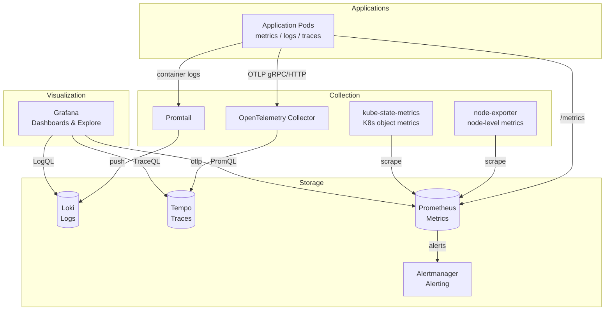

# Observability Stack

A fully open-source observability stack for Kubernetes — metrics, logs, and traces. Deployable to any Kubernetes cluster with Terraform.

## Stack

| Component | Role | License |
|-----------|------|---------|
| [Prometheus](https://prometheus.io/) | Metrics collection & alerting | Apache 2.0 |
| [Alertmanager](https://prometheus.io/docs/alerting/latest/alertmanager/) | Alert routing & deduplication | Apache 2.0 |
| [Grafana](https://grafana.com/) | Dashboards & visualization | AGPL v3 |
| [Loki](https://grafana.com/oss/loki/) | Log aggregation | AGPL v3 |
| [Promtail](https://grafana.com/oss/loki/) | Log collection | AGPL v3 |
| [Tempo](https://grafana.com/oss/tempo/) | Distributed tracing | AGPL v3 |
| [OpenTelemetry Collector](https://opentelemetry.io/docs/collector/) | Trace ingestion (OTLP) | Apache 2.0 |
| [kube-state-metrics](https://github.com/kubernetes/kube-state-metrics) | K8s object metrics | Apache 2.0 |
| [node-exporter](https://github.com/prometheus/node_exporter) | Node-level metrics | Apache 2.0 |

## Quick Start

```bash
cd terraform/examples/basic
cp terraform.tfvars.example terraform.tfvars
terraform init
terraform plan
terraform apply
```

> **Prerequisites**: Kubernetes cluster, Helm 3.x, Terraform 1.5+, `~/.kube/config` pointing to your cluster.

## Access Grafana

```bash
kubectl port-forward -n observability svc/kube-prometheus-stack-grafana 3000:80
```

Open http://localhost:3000 — login `admin` / password from:

```bash
kubectl get secret -n observability kube-prometheus-stack-grafana -o jsonpath="{.data.admin-password}" | base64 -d
```

Or set `grafana_admin_password` in your Terraform config.

## Architecture



See [docs/ARCHITECTURE.md](docs/ARCHITECTURE.md) for detailed architecture, component interactions, and deployment patterns.

## Terraform Module

```hcl
module "observability" {
  source = "github.com/your-org/observability//terraform/modules/observability-stack"

  cluster_name = "my-cluster"
  environment  = "production"
  namespace    = "observability"
}
```

See [terraform/examples/basic](terraform/examples/basic/) for a complete working example.

## Configuration

The module exposes variables for every component. Key overrides:

| Variable | Default | Description |
|----------|---------|-------------|
| `namespace` | `observability` | Deployment namespace |
| `loki_storage_size` | `10Gi` | Loki PVC size |
| `tempo_storage_size` | `10Gi` | Tempo PVC size |
| `kube_prometheus_stack_retention` | `30d` | Prometheus retention |
| `grafana_admin_password` | auto | Grafana admin password |
| `grafana_ingress_enabled` | `false` | Enable Grafana ingress |

Each component also has a `*_values` variable for passing arbitrary Helm values.

## Component Status

| Component | Enabled by Default | Helm Chart |
|-----------|-------------------|------------|
| kube-prometheus-stack | yes | prometheus-community/kube-prometheus-stack |
| Loki | yes | grafana/loki |
| Promtail | yes | grafana/promtail |
| Tempo | yes | grafana/tempo |
| OpenTelemetry Collector | yes | open-telemetry/opentelemetry-collector |

Disable any component with `*_enabled = false`.

## Production Considerations

- Configure **external storage** (S3/GCS/Azure) for Loki and Tempo
- Set **resource requests/limits** appropriate for your cluster size
- Enable **ingress** for Grafana with TLS termination
- Configure **Alertmanager** receivers (Slack, PagerDuty, email)
- Use a dedicated **storage class** with backups
- Set `kube_prometheus_stack_retention` based on your requirements

## License

This project is open-source. All components are licensed under Apache 2.0 or AGPL v3 as noted above.
